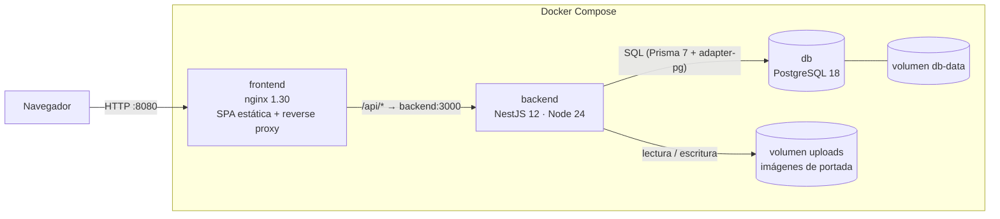
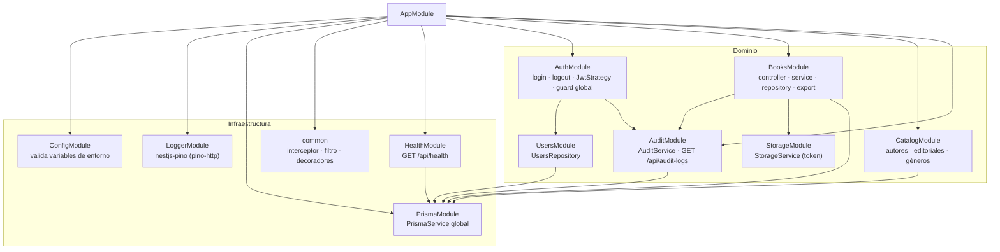
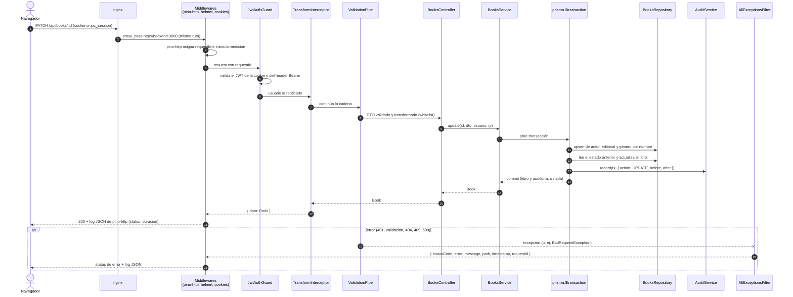

# Arquitectura

Este documento describe cómo se organiza CMPC-libros: los componentes que se despliegan, los
módulos del backend, el recorrido de una request y las decisiones de diseño que sostienen el
código. El modelo de datos se detalla en [database.md](database.md).

## Vista general

- **Un único origen.** El navegador solo habla con nginx (`http://localhost:8080`). nginx sirve
  el build de Vite y reenvía `/api/*` al backend sin reescribir la ruta. Como frontend y API
  comparten origen, la cookie de sesión viaja sin configuración CORS y `SameSite=Strict` basta
  para mitigar CSRF.
- **Backend sin estado.** La sesión vive en un JWT firmado dentro de una cookie `httpOnly`; el
  backend no guarda sesiones en memoria, por lo que puede escalar horizontalmente.
- **Persistencia en volúmenes.** Los datos de PostgreSQL y las imágenes subidas sobreviven a
  `docker compose down` (se eliminan solo con `docker compose down -v`).
- **Arranque autónomo.** Al iniciar, el contenedor del backend aplica las migraciones pendientes
  (`prisma migrate deploy`), ejecuta el seed idempotente y levanta la API. Docker Compose espera
  a que PostgreSQL esté sano antes de iniciar el backend, y a que el backend responda
  `GET /api/health` antes de iniciar nginx.
- **IP real detrás del proxy.** nginx envía `X-Forwarded-For` y `X-Real-IP`, y el backend
  confía en un salto de proxy (`trust proxy = 1`). Así la auditoría registra la IP del cliente y
  el límite de intentos de login se aplica por cliente, no a todos a la vez.

En desarrollo local la topología es la misma, pero el servidor de Vite (`:5173`) cumple el rol
de nginx y hace de proxy de `/api` hacia `http://localhost:3000`.

## Módulos del backend

| Módulo | Responsabilidad |
|---|---|
| `config` | Carga y valida las variables de entorno al arrancar; si falta una o es inválida, la aplicación no inicia. |
| `logger` | Logs JSON de cada request con `nestjs-pino` (pino-http): `requestId`, método, ruta, status y duración. |
| `prisma` | `PrismaService` global (cliente Prisma 7 con `@prisma/adapter-pg`), conexión y cierre ordenado. |
| `auth` | Login y logout, `JwtStrategy` (cookie `cmpc_session` o `Authorization: Bearer`), `JwtAuthGuard` global y decorador `@Public()`, límite de intentos de login. El logout es público: limpia la cookie aunque la sesión ya haya expirado. |
| `users` | Acceso a usuarios por email. Los usuarios se crean con el seed. |
| `books` | CRUD de libros, subida de imagen, soft delete y restauración, exportación CSV en streaming. |
| `catalog` | Listados de autores, editoriales y géneros con búsqueda para autocompletar. |
| `audit` | Registro de auditoría dentro de la misma transacción que el cambio, y consulta paginada. |
| `storage` | Interfaz `StorageService` inyectada por token; implementación en disco local. |
| `health` | Chequeo de salud usado por Docker Compose. |
| `common` | `TransformInterceptor`, `AllExceptionsFilter`, decoradores y utilidades de paginación. |

## Ciclo de vida de una request

Ejemplo: `PATCH /api/books/:id` (editar un libro).

Orden de ejecución en NestJS: middlewares → guards → interceptores (antes) → pipes → controller →
service → interceptores (después). Cualquier excepción, en cualquier etapa, termina en
`AllExceptionsFilter`, que produce siempre el mismo formato de error y mapea los errores
conocidos de Prisma (`P2025` → 404, `P2002` → 409). Los errores 500 nunca exponen el mensaje
interno.

El log HTTP lo emite pino-http como middleware, al terminar la respuesta, y no un interceptor:
un interceptor no registraría las respuestas que se resuelven antes de llegar al controller,
como el 401 del guard o el 404 de una ruta inexistente.

## Decisiones de arquitectura

### Capas con una sola responsabilidad (SRP)

- **Controller:** entrada HTTP, validación mediante DTOs y obtención del usuario actual y la IP.
- **Service:** reglas de negocio y límites transaccionales.
- **Repository:** consultas Prisma. Es la única capa que conoce el ORM.

La lógica pura se extrae a funciones sin dependencias (`parseSort` y `buildBookQuery`), que
traducen los parámetros de la URL a `where` y `orderBy` de Prisma y se testean sin base de datos.

### Abierto a extensión, dependiente de abstracciones (OCP y DIP)

`BooksService` depende de la interfaz `StorageService`, registrada con un token de inyección, y
no de `LocalDiskStorageService`. Guardar imágenes en S3 o MinIO consiste en agregar una
implementación nueva y seleccionarla por variable de entorno, sin modificar el servicio de
libros.

### Implementaciones intercambiables (LSP)

Cualquier implementación de `StorageService` cumple el mismo contrato: los tests de
`LocalDiskStorageService` usan un directorio temporal, y una implementación S3 debería pasar los
mismos casos.

### Interfaces pequeñas (ISP)

`AuditService` expone una única operación de escritura, `record(tx, entry)`, y los repositorios
reciben el cliente transaccional `tx` como parámetro. Así, libro y auditoría se escriben en la
misma transacción sin que `BooksRepository` conozca a `AuditService`.

### Dependencias explícitas

El usuario autenticado y la IP se pasan como argumentos del controller al service; no hay
contexto implícito por request. Los tests construyen esos valores directamente.

### Transacciones y auditoría

Crear, editar, eliminar y restaurar un libro se ejecutan dentro de `prisma.$transaction`: el
upsert de autor, editorial y género, el cambio del libro y el registro en `audit_logs` se
confirman juntos o no se confirma ninguno. No puede existir un cambio sin su auditoría.
Restaurar un libro que no está eliminado responde 200 con el libro y no genera auditoría.

### Respuestas y errores uniformes

- Éxito: `{ data, meta? }` (lo aplica `TransformInterceptor`, salvo archivos en streaming y 204).
- Error: `{ statusCode, error, message, path, timestamp, requestId }` (lo produce
  `AllExceptionsFilter`). El `requestId` coincide con el de los logs y el header `X-Request-Id`.

### Seguridad

- JWT en cookie `httpOnly`, `SameSite=Strict` y `Secure` configurable: el código del navegador
  nunca accede al token.
- Rutas públicas: login, logout, `GET /api/health`, la documentación Swagger y las imágenes en
  `/api/uploads/*`. El resto exige sesión (guard global).
- Contraseñas con Argon2id.
- `ValidationPipe` global con `whitelist` y `forbidNonWhitelisted`: los campos del body y los
  parámetros de query no declarados se rechazan con 400. Los filtros vacíos o con solo espacios
  se tratan como ausentes.
- `helmet`, límite de intentos en login y CORS restringido al origen del frontend en desarrollo.
- `trust proxy` limitado a un salto (nginx), para que la IP de auditoría y del límite de
  intentos sea la del cliente.
- Imágenes validadas por tipo (JPEG, PNG, WebP) y tamaño (2 MB) y guardadas con nombre UUID;
  nginx corta cualquier cuerpo superior a 3 MB antes de que llegue al backend.
- Sin secretos en el código: todo se configura por variables de entorno validadas al arrancar.

### Observabilidad

Logs JSON con `nestjs-pino` (pino-http): cada línea incluye `requestId`, método, ruta, status y
duración, también para las respuestas que corta el guard o el router. El `requestId` se devuelve
en el header `X-Request-Id` y en el cuerpo de los errores. El healthcheck `GET /api/health`
verifica la conexión a la base de datos.

### Frontend

- **Organización por features** (`auth`, `books`, `catalog`) con componentes de UI compartidos en
  `components/ui` y utilidades en `lib` y `shared`.
- **Estado del listado en la URL** (página, filtros, búsqueda y orden): se puede compartir,
  sobrevive a recargas y es la clave de caché de TanStack Query.
- **Datos del servidor con TanStack Query:** caché, reintentos, invalidación tras mutaciones y
  `keepPreviousData` para paginar sin parpadeo.
- **Rutas protegidas con loaders** de React Router: la sesión se valida con `/api/auth/me` antes
  de renderizar.
- **Cliente HTTP único** (axios con `withCredentials`): ante un 401 limpia la sesión y redirige a
  `/login`; normaliza los errores a `ApiError { status, message }`.

### Monorepo simple

`backend/` y `frontend/` son aplicaciones independientes, cada una con su `package.json`,
lockfile, tests y Dockerfile. No hay workspaces ni herramientas de monorepo: menos configuración
y un onboarding más directo. El costo es que los tipos de la API se declaran en ambos lados; la
mejora prevista es generar el cliente del frontend desde el OpenAPI del backend (ver Roadmap en
el README).
