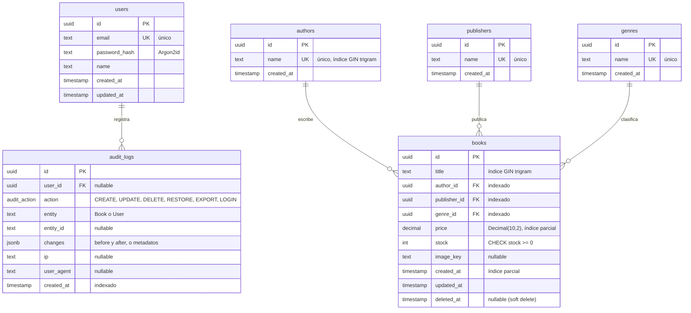

# Modelo de datos

CMPC-libros usa PostgreSQL 18 con Prisma 7. El esquema fuente es `backend/prisma/schema.prisma`
y la evolución del esquema se versiona en `backend/prisma/migrations/`. Este documento explica
el modelo y sus decisiones; el mismo modelo está disponible en DBML en
[schema.dbml](schema.dbml) para visualizarlo en [dbdiagram.io](https://dbdiagram.io).

## Diagrama entidad-relación

## Tablas

| Tabla | Propósito |
|---|---|
| `users` | Usuarios internos de la tienda. Se crean con el seed; no hay registro público. |
| `authors` | Autores, con nombre único. |
| `publishers` | Editoriales, con nombre único. |
| `genres` | Géneros, con nombre único. |
| `books` | Inventario. Cada libro referencia a un autor, una editorial y un género. |
| `audit_logs` | Traza de operaciones: quién, qué, cuándo, desde qué IP y con qué cambios. |

## Normalización

El modelo está en tercera forma normal:

- **Autor, editorial y género son entidades propias** y `books` solo guarda sus claves foráneas.
  Un nombre se almacena una sola vez, los filtros del listado son exactos por ID y se evitan
  duplicados por errores de tipeo ("Planeta" y " Planeta " se guardan como un único registro).
- **La escritura es por nombre.** El formulario envía `authorName`, `publisherName` y
  `genreName`; el backend normaliza el texto (`trim`) y hace upsert por nombre dentro de la misma
  transacción que guarda el libro. El usuario elige un valor existente o crea uno nuevo sin
  pasos adicionales.
- **La unicidad del nombre distingue mayúsculas.** "Planeta" y "planeta" serían dos registros;
  el formulario lo previene reutilizando el nombre existente cuando el texto coincide sin
  distinguir mayúsculas. La unicidad insensible a mayúsculas (índice único sobre
  `lower(name)` o columna `citext`) está en el Roadmap del README.
- **La disponibilidad no se almacena:** se deriva como `available = stock > 0`. Guardar ambos
  valores permitiría estados contradictorios.

## Tipos y restricciones

| Columna | Tipo | Motivo |
|---|---|---|
| `*.id` | `uuid` | Identificadores no secuenciales: no revelan volumen ni permiten enumerar recursos. |
| `books.price` | `Decimal(10,2)` | Aritmética exacta para dinero; un `float` acumula errores de redondeo. Moneda: CLP. |
| `books.stock` | `integer`, `CHECK (stock >= 0)` | La base de datos rechaza stock negativo aunque falle una validación previa. |
| `books.image_key` | `text`, nullable | Solo el nombre del archivo (UUID + extensión); la URL pública se arma en la API como `/api/uploads/<image_key>`. |
| `books.deleted_at` | `timestamp`, nullable | Soft delete con fecha (ver más abajo). |
| `audit_logs.action` | enum `audit_action` | Conjunto cerrado de acciones auditables. |
| `audit_logs.changes` | `jsonb` | Estado anterior y posterior del libro, o los filtros usados en una exportación. |
| `audit_logs.user_id` | `uuid`, nullable | La auditoría se conserva aunque el usuario se elimine. |

## Índices

Los índices del listado son **parciales** (`WHERE deleted_at IS NULL`). Un índice suelto sobre
`deleted_at` aporta poco porque casi todas las filas tienen `NULL`, y uno compuesto
`(deleted_at, title)` todavía obliga a ordenar; el parcial es más pequeño (excluye eliminados) y
ya está en el orden pedido. Se declaran en `schema.prisma` con la preview feature
`partialIndexes` de Prisma 7 (`@@index([title], where: { deletedAt: null })`), por lo que no
generan *drift* entre el esquema y las migraciones.

| Índice | Tipo | Consulta que lo aprovecha |
|---|---|---|
| `books(author_id)`, `books(publisher_id)`, `books(genre_id)` | B-tree | Filtros del listado por autor, editorial y género. |
| `books(created_at)`, `books(title)`, `books(price)` `WHERE deleted_at IS NULL` | B-tree **parcial** | Listado ordenado: todas las consultas filtran `deleted_at IS NULL`, así que el índice solo contiene libros activos y entrega las filas ya ordenadas (`Index Scan`, sin `Sort`). |
| `books(title)` | GIN `gin_trgm_ops` | Búsqueda `ILIKE '%texto%'` sobre el título. |
| `authors(name)` | GIN `gin_trgm_ops` | Búsqueda `ILIKE '%texto%'` sobre el nombre del autor. |
| `audit_logs(entity, entity_id)` | B-tree | Historial de un libro concreto. |
| `audit_logs(user_id)` | B-tree | Actividad de un usuario. |
| `audit_logs(created_at)` | B-tree | Listado de auditoría ordenado por fecha. |
| `users(email)`, `authors(name)`, `publishers(name)`, `genres(name)` | B-tree único | Unicidad y búsqueda exacta (login, upsert por nombre). |

### Búsqueda con trigramas

La búsqueda en tiempo real usa `ILIKE '%texto%'`. Un índice B-tree no sirve para patrones con
comodín inicial, por lo que PostgreSQL recorrería la tabla completa. La extensión `pg_trgm`
descompone el texto en trigramas y permite que un índice GIN resuelva esas búsquedas.

- La extensión se habilita en una migración con SQL: `CREATE EXTENSION IF NOT EXISTS pg_trgm;`.
- Los índices se **declaran en `schema.prisma`**, por ejemplo
  `@@index([title(ops: raw("gin_trgm_ops"))], type: Gin, map: "books_title_trgm_idx")`.
  Un índice creado solo con SQL no forma parte del esquema de Prisma: se detecta como *drift* y
  la siguiente migración generada lo eliminaría.

## Soft delete

Eliminar un libro asigna `deleted_at = now()` en lugar de borrar la fila:

- Se conserva cuándo se eliminó, lo que permite restaurarlo (`POST /api/books/:id/restore`) y,
  a futuro, purgar registros por antigüedad.
- La auditoría sigue apuntando a un libro existente.
- Los repositorios filtran `deletedAt: null` de forma explícita en cada consulta, sin
  middleware implícito: el comportamiento es visible en el código y está cubierto por tests.

## Transacciones

Crear, editar, eliminar y restaurar un libro se ejecutan en una única `prisma.$transaction` que
incluye:

1. El upsert por nombre de autor, editorial y género.
2. La escritura del libro.
3. El registro en `audit_logs` con el estado anterior y posterior.

Si cualquier paso falla, no se confirma nada: no existe un cambio sin su auditoría ni una
auditoría sin su cambio. Los repositorios reciben el cliente transaccional `tx` como parámetro,
lo que permite componer estas operaciones sin acoplar los repositorios entre sí.

La exportación CSV registra una entrada `EXPORT` con los filtros usados, y cada login exitoso
registra una entrada `LOGIN`.

## Migraciones y datos iniciales

- **Desarrollo:** `npx prisma migrate dev` crea y aplica migraciones a partir de
  `schema.prisma`. El SQL que Prisma no expresa (la extensión `pg_trgm` y el `CHECK` de stock) se
  agrega a la migración generada con `--create-only`.
- **Despliegue:** `npx prisma migrate deploy` aplica solo las migraciones pendientes; el
  contenedor del backend lo ejecuta en cada arranque.
- **Seed:** `npx prisma db seed` crea el usuario administrador y un catálogo inicial de libros
  (literatura chilena, latinoamericana y clásicos), con algunos títulos agotados. Es idempotente:
  usa upserts por email, por nombre y por título + autor, por lo que puede ejecutarse en cada
  arranque sin duplicar datos.
